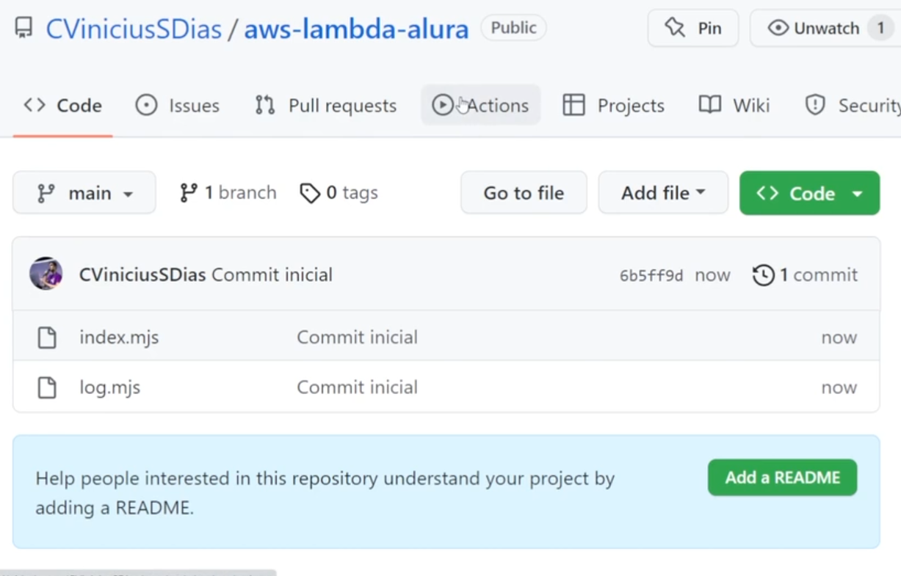
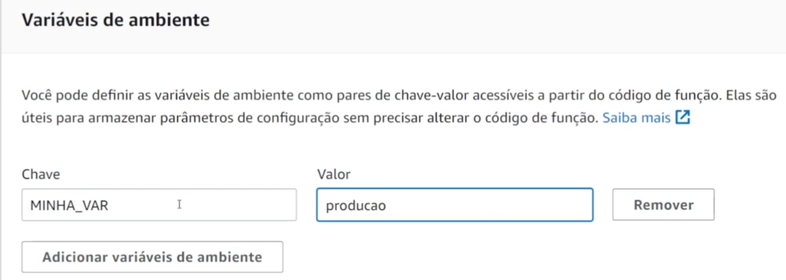

# Lambda AWS:.

## Serverless

````
Sem servidor: Para executar uma atividade rapidamente
Cobrado pelo numero de execuções da tarefa x tempo rodando
Uma função pode chamar outras
$ aws lambda invoke --function-name <nome-da-funcao> <arquivo-com-saida-da-funcao.txt> <- Para execuar pelo AWS CLI
As lambdas utilizão gatilhos para executar:
Amazon Event Bridge criar um gatilho que executa a lambda 1x por dia
S3 - Para manipular arquivos na AWS
````

### Gatilho: Event Bridge

Todo dia as 18h                                                                 <br>
                                                             <br>
Ao acontecer chama a lambda                                                     <br>
                                                         <br>

### Gatilho: Ao adicionar no S3

                                                         <br>
                                                         <br>
Agora quando recebe uma imagem ele executa a lambda, verificar no Cloudwatch.   <br>
Node: Executa o que chegou e imprime o log.                                     <br>
                                                         <br>
Ajustando o consumo de memória, se executar mais tempo ele encerra.             <br>
                                                         <br>

````
Consigo editar pelo site da aws ou gerar um zip e fazer upload pelo CLI
$ aws lambda update-function-code --function-name primeiraFuncao --zip-file fileb://lambda.zip
````

### GitHub Actions

                                                         <br>
https://github.com/marketplace/actions/aws-lambda-deploy                        <br>
Mais utilizada:                                                                 <br>
Fazer o commit da lambda                                                        <br>
                                                         <br>
Escondendo as chaves AWS - Settings - Secrets and variables - Actions           <br>
                                                         <br>
Volte para actions e vamos criar a action - set up a workflow yourself          <br>
Agora quando faz o push ele já atualiza a lambda                                <br>
Quando utilizamos dependências externas, precisamos enviá-las junto com nossa aplicação, pois a AWS Lambda não as
instala automaticamente em suas runtimes. <br>

````
name: deploy to lambda
on: [push]
jobs:
  deploy_zip:
    name: deploy lambda function
    runs-on: ubuntu-latest
    steps:
      - name: checkout source code                      #Pegar o codigo
        uses: actions/checkout@v1
      - name: Generate ZIP                              #Gerar o ZIP
        run: |
          zip deployment.zip *.mjs
      - name: default deploy                            #Fazer o deploy da Master
        uses: appleboy/lambda-action@master
        with:
          aws_access_key_id: ${{ secrets.AWS_ACCESS_KEY_ID }}
          aws_secret_access_key: ${{ secrets.AWS_SECRET_ACCESS_KEY }}
          aws_region: ${{ secrets.AWS_REGION }}
          function_name: primeiraFuncao
          zip_file: deployment.zip
````

### Variaveis de Ambiente

                                                         <br>
                                                       <br>

### URL da função

                                                       <br>
                                                       <br>
Configurando a resposta no formato HTML                                         <br>
                                                       <br>

### Runtime Personalizada - Atraves de uma imagem de container (Inicialização mais lenta para aquecer)

ECR - Envia a imagem para o repositório da AWS                                  <br>
                                                       <br>
                                                       <br>
                                                       <br>
                                                       <br>
                                                       <br>
No debploy o Github Actions é diferente, precisa gerar uma nova imagem          <br>
No caso de lambdas Java podemos executar ela para deixar sempre ativa (hot), executando a proxima chamada mais
rápido<br>
Imagem do PHP:.                                                                 <br>
https://gist.github.com/CViniciusSDias/21b2073f73c9c928207d163c792e063c         <br>
                                                       <br>

### Testando a lambda local

https://docs.aws.amazon.com/pt_br/serverless-application-model/?id=docs_gateway <br>
https://docs.aws.amazon.com/pt_br/serverless-application-model/latest/developerguide/what-is-sam.html <br>
https://www.serverless.com/framework/docs/getting-started                       <br>

### Simular um codigo que limita upload na lambda

````
import { log } from './log.mjs';
import { S3 } from '@aws-sdk/client-s3';                    <- Import direto da AWS

const s3Client = new S3({ region: 'us-east-1' });           <- Seta a região
export const handler = async(event) => {

    const record = event.Records[0];
    const Bucket = record.s3.bucket.name;
    const Key = record.s3.object.key;                       <- Busca o objeto no s3
    const getObjectResult = await s3Client.getObject({      <- Assincrono
        Bucket,
        Key,
    });
    const mega_byte = 1024 * 1024;                          <- Converte para Megabytes

    if (getObjectResult.ContentLength > 1 * mega_byte) {
        log('Objeto muito grande');
        return 'Objeto muito grande';
    }

    log('Objeto de tamanho OK');
    return 'Objeto de tamanho OK';
};
````

https://github.com/alura-cursos/aws-lambda-alura                                <br>


